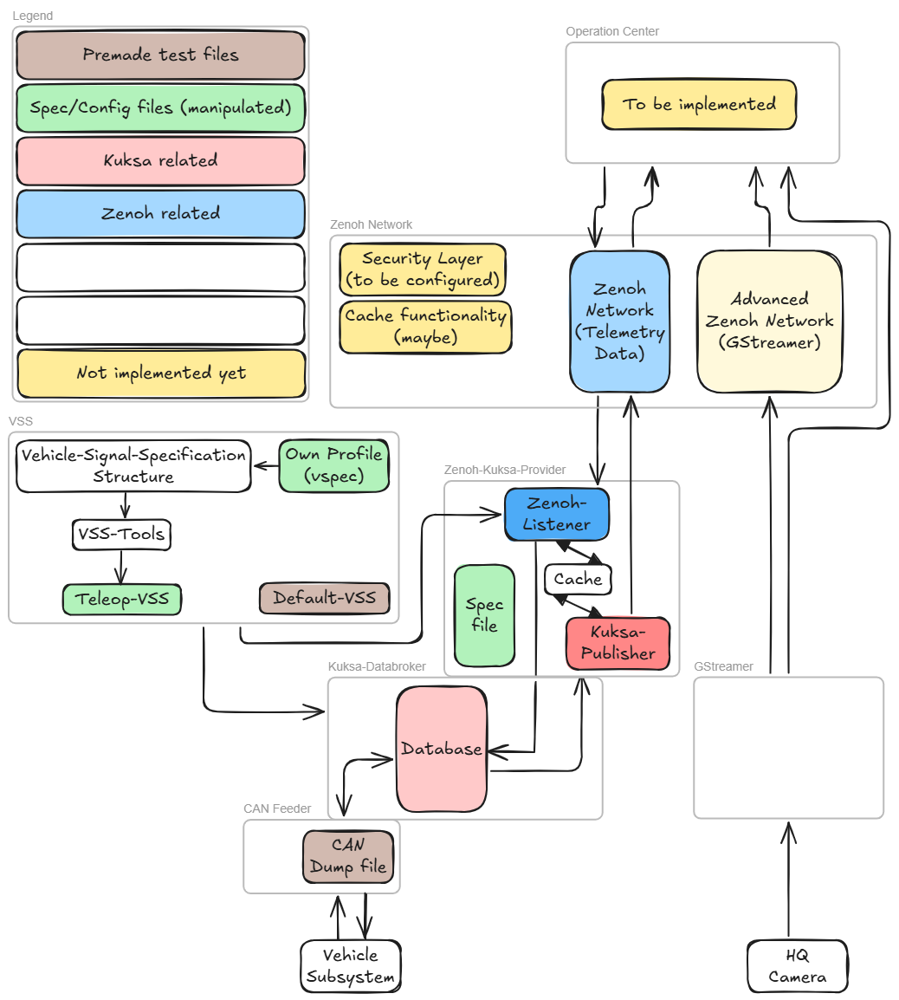

# Teleop

## Description

This project has the purpose to conceive and realize the stack and implementation for teleoperated driving.

It uses [zenoh](./docs/zenoh_network) to maintain connection while driving and allows management from a distance. 
To store the used data, especially for the subsystem, the [kuksa databroker](./docs/kuksa_databroker) is used.
This allows the corresponding CAN Feeder ([CAN Provider](./docs/CAN_Provider)) to write CAN messages to the vehicle. 
For the communication between kuksa and zenoh a [VSS](./VSS) (more specific: a vspec file) is needed.
Through a custom vspec file a VSS for the Zenoh-Kuksa-Provider and the kuksa databroker is generated.